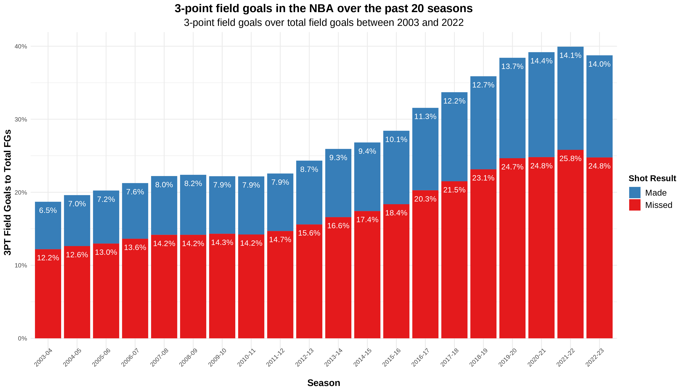
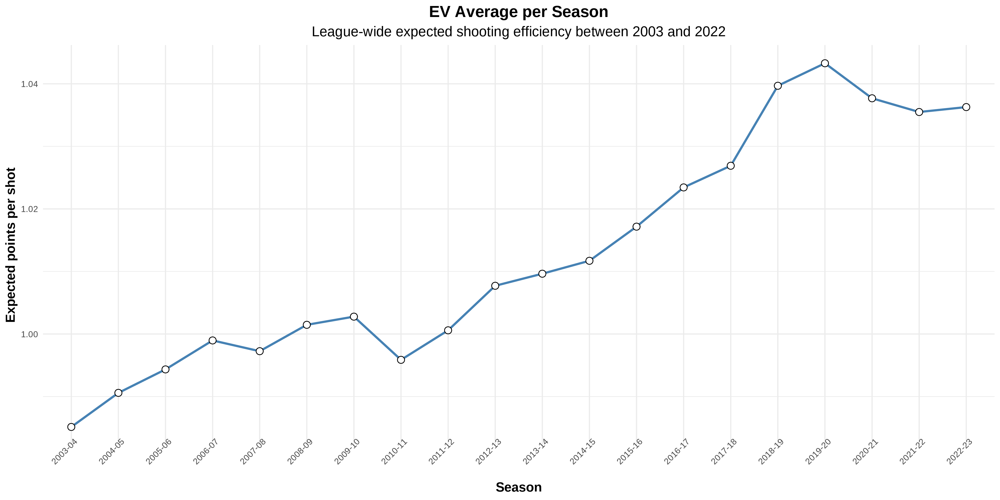
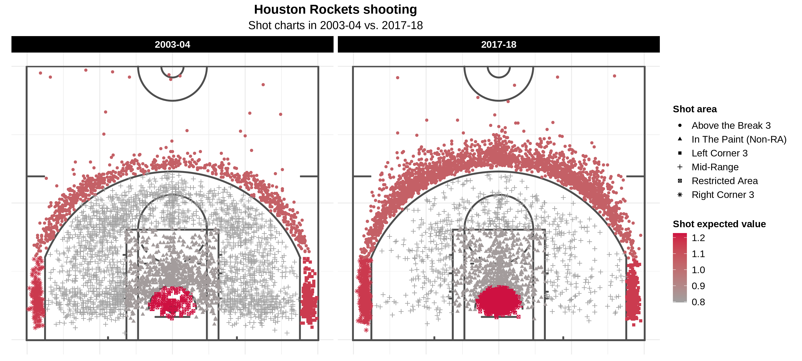
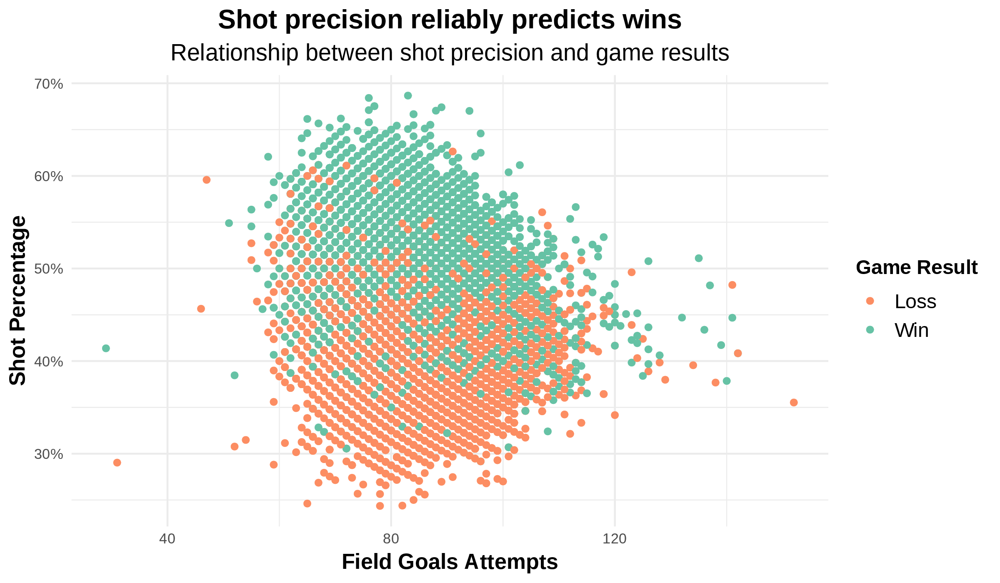
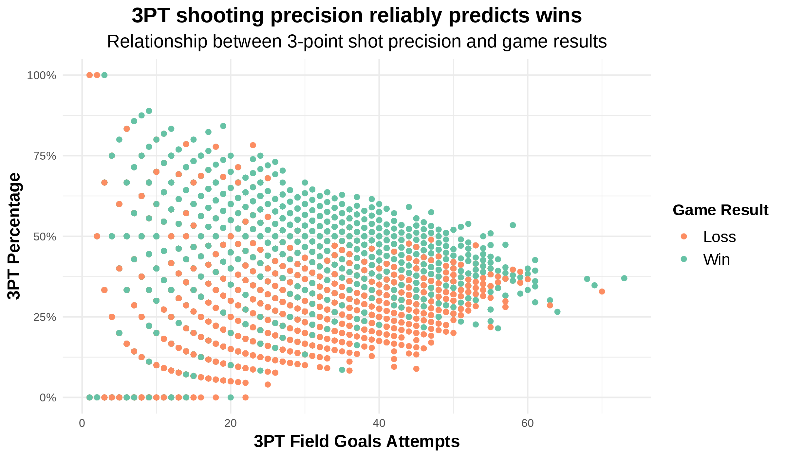
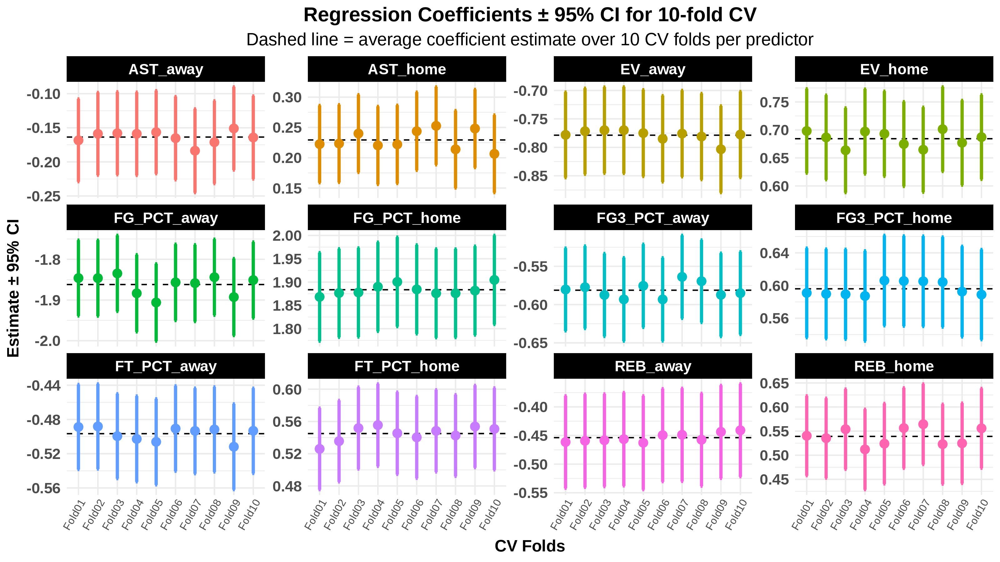
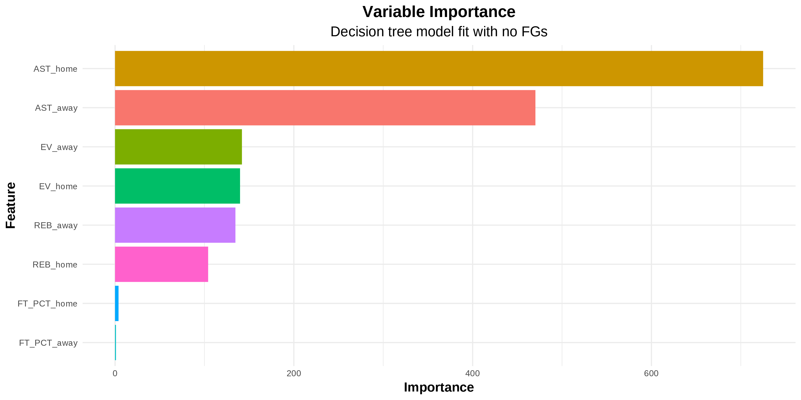
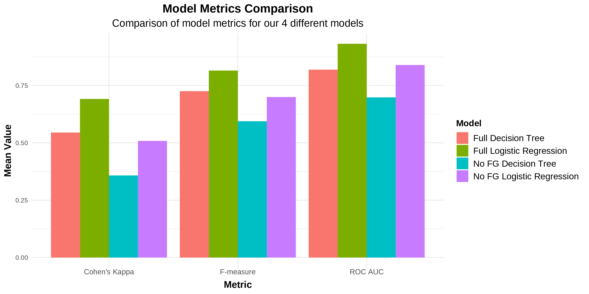

```{r setup, include=FALSE, purl=TRUE}
## Setup options for R Markdown

# Load libraries
library(knitr)       # provides the kable function & chunk options
library(kableExtra)  # provides kable_styling for kable settings
library(tidyverse)   # loads amongst others dplyr, tidyr and ggplot2

# Set basic display options
options(digits = 3)  # limit the number of significant digits

# Set knitr options
opts_chunk$set(
  echo       = FALSE,    # Do not print code
  warning    = FALSE,    # Suppress warnings
  message    = FALSE,    # Suppress messages
  fig.align  = "center"  # Center figures
)

```

# Introduction

The NBA has undergone a significant transformation towards data-driven decision-making, influenced by the broader trend in various industries. This thesis explores how the NBA's evolution has been shaped by data analytics, with a focus on shooting strategies. It draws inspiration from Moreyball, the playing strategy that Daryl Morey, an important figure in NBA basketball, helped popularize. The project aims to establish a quantitative relationship between efficient shot selection and team success.

## Data under study

This thesis analyzes a comprehensive collection of basketball statistics, including shot coordinates, game results, and player statistics, sourced primarily from the official NBA statistics API.

- *NBA Shots dataset*: A dataset spanning 2004 to 2023 which provides shot details from NBA games.

- *NBA Games dataset*: A dataset capturing team-based game results over the past 20 seasons.

- *NBA Games Details dataset*: A dataset that contains player statistics for each game in the games dataset.

# Exploratory data analysis

Exploratory data analysis involves intersecting and cross-checking multiple datasets to extract features relevant to our analysis, which involves studying different aspects of shooting data from NBA games, analyzing shot efficiency, and understanding the importance of shot selection in winning games.

## 3-point field goals

Our initial focus was on the 3-point field goals over the past 20 seasons. The count of shot attempts and the ratio of three-point attempts to total attempts were calculated. This data was filtered to only include three-point shot information, and the shot results were labeled as "Made" (successful shots) or "Missed" (unsuccessful shots). As it shows, there has been a significant increase in the relative frequency of 3-point attempts to total attempts over time, meaning that increasing 3 point shooting has been identified as a sensible strategy.

---

```{r 3ptprog, out.width="100%", fig.cap="3-point field goals over total field goals (2003-04 to 2022-23)"}


```

## The Expected Value statistic

We computed the expected value (`EV`) of a shot in each court area as the probability of success multiplied by its point value.

```{r evinfo, purl=TRUE}

# load nba shots dataset
shots <- read_csv("dataset/nbashots0423/NBA_2004_2023_Shots.csv")

# preprocess the data in the shots dataset
shots %<>%
  # remove a few unneeded variables from the dataset
  select(-SEASON_1, -EVENT_TYPE, -GAME_DATE,
         -POSITION, -POSITION_GROUP, -ZONE_ABB,
         -PLAYER_ID, -PLAYER_NAME) %>%
  # join mins left and secs left inside the same variable
  unite(TIME_LEFT, c(MINS_LEFT,SECS_LEFT), sep = ":") %>%
  # make some ids shorter
  mutate(TEAM_ID    = as.numeric(str_sub(TEAM_ID, -2)),
         SHOT_TYPE  = as.numeric(str_sub(SHOT_TYPE, 1, 1)),
         # make sure no outdated names/abbreviations are used
         TEAM_NAME  = case_when(
         TEAM_NAME %in% c("New Orleans Hornets",
                          "New Orleans/Oklahoma City Hornets")
                          ~ "New Orleans Pelicans",
         TEAM_NAME == "New Jersey Nets" ~ "Brooklyn Nets",
         TEAM_NAME == "Seattle SuperSonics" ~ "Oklahoma City Thunder",
         TEAM_NAME == "LA Clippers" ~ "Los Angeles Clippers",
         TEAM_NAME == "Charlotte Bobcats" ~ "Charlotte Hornets",
         TRUE ~ TEAM_NAME),
         HOME_TEAM  = case_when(
         HOME_TEAM %in% c("NOH", "NOK") ~ "NOP",
         HOME_TEAM == "NJN" ~ "BKN",
         HOME_TEAM == "SEA" ~ "OKC",
         TRUE ~ HOME_TEAM),
         AWAY_TEAM  = case_when(
         AWAY_TEAM %in% c("NOH", "NOK") ~ "NOP",
         AWAY_TEAM == "NJN" ~ "BKN",
         AWAY_TEAM == "SEA" ~ "OKC",
         TRUE ~ AWAY_TEAM))

# Calculate total shots made and attempted in each BASIC_ZONE
# and calculate the probability of a shot being made in each BASIC_ZONE.
# Finally, calculate the expected value of a shot in each BASIC_ZONE.
EV_info <- shots %>%
  filter(SHOT_MADE) %>%
  count(BASIC_ZONE, SHOT_TYPE, name = "TOT_MADE") %>%
  left_join(count(shots, BASIC_ZONE, SHOT_TYPE, name = "ATTEMPTS")) %>%
  mutate(PROB = TOT_MADE/ATTEMPTS, EV = PROB*SHOT_TYPE) %>%
  group_by(BASIC_ZONE) %>%
  filter(ATTEMPTS == max(ATTEMPTS)) %>%
  select(BASIC_ZONE,EV) %>%
  arrange(desc(EV))

kable(EV_info, linesep = "",
      caption = "Expected values of shots
                 taken from each area of the court",
      col.names = c("Court Area",
                    "EV")) %>%
  kable_styling(latex_options = "HOLD_position")
```

---

We computed the average expected value per shot for each season and displayed it in a line chart, proving how teams have actively implemented strategies that facilitate statistically efficient shooting.

```{r evprog, out.width="100%", fig.cap="Expected shooting efficiency (2003-04 to 2022-23)"}


```

---

Teams have been moving from a heavy reliance on mid-range shooting, towards a bigger emphasis on 3-pointers and shots closer to the restricted area, the most efficient shooting zone. The Houston Rockets, shown below, have been led to great results by Daryl Morey's data-driven approach.

```{r rockets, out.width="90%", fig.cap="Houston Rockets shooting charts in 2003-04 and 2017-18"}


```

---

As we can see from the relationship between shot precision and game results, we can expect that including field goal accuracy statistics will make for extremely accurate game prediction.

```{r fgpred, fig.ncol=2, out.width="49%", fig.cap="Role of shot precision in games predictions", fig.subcap=c("Shot precision relationship with game results", "3PT precision relationship with game results")}



```

# Methodology

Our methodology centers around the idea of integrating various types of statistical modeling to predict NBA game outcomes. A key component of our approach is the use of the "Expected Value" (`EV`) feature, which we derive from the NBA shots dataset and which represents a given shot type's expected efficiency based on data from the past 20 years. In our analysis, we are mostly interested in seeing whether `EV` is useful as a companion to field goal accuracy metrics, and then whether it can also be useful as a predictor for game results on its own.

## Variables selection

Our outcome variable is binary, reflecting whether or not the home team won the game. Therefore, for each predictor statistic, we incorporate both the home and away team's data. Besides the `EV` feature, the predictors also include field goal precision (`FG_PCT`), 3-point FG precision (`FG3_PCT`), free throw precision (`FT_PCT`), assists (`AST`), and rebounds (`REB`), for both the home and away teams.

However, in assessing the prediction improvement yielded by the `EV` feature, we may choose to exclude field goal statistics (`FG`, `FG3`). Including these variables might skew the analysis and overshadow the contribution of other variables, such as the `EV` feature, therefore we fit models that both include and omit field goal statistics.

## Predictive modeling techniques

We use two types of statistical models in our analysis: Logistic Regression and Decision Trees.

- *Logistic Regression*: The model predicts the probability of the positive class (in this case, the home team winning) as a logistic function of a linear combination of the predictors.

- *Decision Trees*: The model partitions the predictor space into several regions, and assigns a prediction to each region.

For both models, we partition our data into a training set (seasons up to 2019) and a testing set (seasons after 2019). After fitting the models to the training data, we assess their performance on the testing data by employing $k$-fold cross-validation.

# Prediction and modeling

## Model fitting

In this section, we perform predictive modeling using logistic regression and decision trees, and discuss the results by evaluating performance metrics for each of the model fits.

When fitting a logistic regression model including all variables through $k$-fold cross-validation, the result is that the efficiency of shots for the home and away teams are statistically significant predictors at any significance level. The coefficients for `EV_home` and `EV_away` are positive and negative, respectively, indicating that increased shot value for the home team and decreased shot value for the away team both lead to a higher probability of a home team win. This same pattern also holds for the other variables.

---

```{r regcoeffs, out.width="100%", fig.cap="Coefficients for 10-fold full model cross-validation"}


```

---

The decision tree model is subsequently fit to the training data, using the same predictors. The variable importance plots rank the predictors according to their weight in the decision tree models. Importance scores are a way of scoring how useful each feature is for creating splits in our data.

When we remove the field goal statistics from the model, the decision tree uses `AST`, `EV`, and `REB` as primary splits. The importance of these variables is confirmed in the variable importance plot without FGs, shown as follows. From here, we can see that the role of the `EV_home` and `EV_away` statistics is quite important in the decisions adopted by the tree model.

---

```{r vipnofg, out.width="100%", fig.cap="Variable Importance plot for model without shooting variables"}


```

## Model evaluation metrics

In order to evaluate our models, we can show a number of metrics that all evaluate the quality of classification.

- *Cohen's Kappa ($\kappa$)*: It gauges the level of agreement between the predicted and actual classes beyond what would be expected by chance.

- *F-measure ($F$)*: It is the harmonic mean of precision and recall, which provides a balanced measure especially useful in uneven class distribution scenarios.

- *ROC AUC*: It represents a model's ability to distinguish between classes, with an AUC value between 0 (100% wrong predictions) and 1 (100% correct predictions).

---

The model metrics comparison shows that logistic regression models outperform decision tree models in terms of all metrics, regardless of whether field goal statistics are included or not.

```{r metricsplot, out.width="100%", fig.cap="Comparison of model metrics for 4 different models"}


```

# Conclusions

In summary, our analysis demonstrates that including the efficiency of shots that a team takes as an explanatory variable can enhance the prediction of NBA game outcomes.

However, a crucial limitation is that our predictions are retrospective in nature. The models developed in this study are based on post-game data, meaning they aim to explain the key components that influenced a game's outcome, rather than forecasting future results.

Overall, while this research offers some insights into predicting NBA game outcomes, there is significant scope for refinement. Future research could benefit from utilizing a different modeling approach.