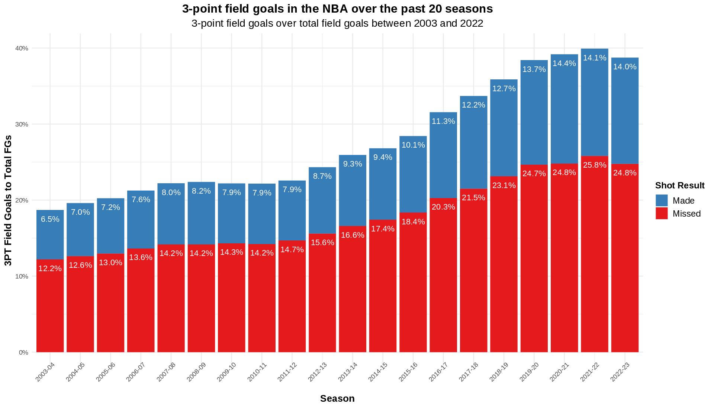

```{r setup, include=FALSE, purl=TRUE}
## Setup options for R Markdown

# Load libraries
library(knitr)       # provides the kable function & chunk options
library(kableExtra)  # provides kable_styling for kable settings
library(tidyverse)   # loads amongst others dplyr, tidyr and ggplot2
library(tidymodels)  # loads several packages useful for model testing
library(rpart.plot)  # provides plotting helper for decision trees

# Set basic display options
options(
  digits = 3,   # limit the number of significant digits
  width  = 63   # limit the width of code output
)

# Set knitr options
opts_chunk$set(
  echo       = FALSE,    # Do not print code
  warning    = FALSE,    # Suppress warnings
  message    = FALSE,    # Suppress messages
  fig.align  = "center"  # Center figures
)

# Set a default ggplot theme
theme_set(
  theme_minimal() +
  theme(plot.title = element_text(face = "bold", size = 16,
                                  hjust = 0.5),
        plot.subtitle = element_text(hjust = 0.5, size = 14),
        axis.title = element_text(face = "bold", size = 13),
        axis.text.x = element_text(vjust = 1.5),
        legend.title = element_text(face = "bold", size = 12),
        legend.text = element_text(size = 12),
        strip.background = element_rect(fill = "black"),
        strip.text = element_text(face = "bold", size = 12,
                                  color = "white")))
```

\newpage

# Introduction

The National Basketball Association (NBA), the world's most popular basketball league, has experienced a significant transformation in its strategy and play over the past two decades. This shift, mirroring the broader trend in various industries, is a transition towards data-driven decision-making. With the advent and proliferation of advanced analytics, teams are increasingly exploiting these tools to gain a competitive edge. This thesis aims to delve into the specifics of how the NBA's evolution has been influenced by data analytics, with a particular emphasis on the strategic implications of shooting from statistically favorable areas.

The inception of a statistically-driven approach in sports was marked by the application of advanced analytics in baseball, most notably by Billy Beane of the Oakland Athletics. The core idea was to leverage data to identify undervalued players and strategies, subsequently gaining a competitive edge despite budget constraints. This innovative approach, detailed in Michael Lewis's book "Moneyball" [@Moneyball], transformed not just baseball, but the wider sporting world, setting the stage for similar data-driven revolutions in other sports.

The dawn of the Moneyball era in sports, which highlighted the effectiveness of quantitative analysis in baseball, laid the groundwork for similar applications in basketball. Recent years have seen an exponential increase in the depth and breadth of available basketball-related data, fueling the NBA's analytics revolution. Teams now use these advanced metrics not just for player evaluation and scouting, but also to devise intricate game plans and strategies.

In the realm of basketball, a noteworthy adaptation of the Moneyball concept was championed by Daryl Morey, the former general manager of the Houston Rockets team, and president of basketball operations for the Philadelphia 76ers as of June 2023. Morey's approach, colloquially termed "Moreyball" [@Moreyball], prioritized efficiency in shot selection based on their expected point value. More specifically, Moreyball emphasizes three-point shots, layups, and free throws, while devaluing mid-range jumpers, a philosophy that fundamentally diverges from traditional basketball strategies.

The success of the Houston Rockets under Morey's stewardship helped cement the value of analytics in basketball strategy. His tenure saw a marked increase in the team's three-point attempt rate, reflecting the strategic shift driven by data analysis. The Rockets' sustained competitive performance further underscored the efficacy of the Moreyball approach.

This study draws inspiration from the principles of both Moneyball and Moreyball, seeking to illuminate the relationship between shot selection efficiency and game outcomes in the NBA. We apply a similar analytical lens to understand the evolution of the league over the past 20 seasons and develop a custom metric to enhance the accuracy of game outcome predictions. While our research is firmly rooted in the NBA, the underlying principle of data-driven decision-making carries potential implications for various sports and competitive endeavors.

Ultimately, the project attempts to quantitatively establish a relationship between a team's propensity to shoot from these statistically favorable areas and their success in winning games. Leveraging the rich datasets that capture detailed game statistics, shot outcomes, and team results, we apply various models to demonstrate the link between effective shooting strategies and team success.

The analysis is performed using the statistical software `R`, utilizing powerful libraries such as the data manipulation suite `tidyverse` [@RTidyverse] and the modeling tooling collection `tidymodels` [@RTidymodels]. Through meticulous data cleaning, transformation, and exploration, we extract the most meaningful insights and present them in an accessible manner. The models derived in this thesis serve as preliminary steps towards interpreting the complex dynamics that underpin modern NBA strategies.

By the conclusion of this dissertation, readers will hopefully gain a more nuanced perception of the expanding role of analytics in the NBA. Furthermore, they should be equipped with a basic understanding of how data analytics can be used to enhance prediction accuracy in strategic decision-making. The custom metric introduced in this work illustrates this point, contributing to an improvement in game prediction. While this research does not claim to revolutionize sports analytics, it aims to provide a valuable perspective to the broader conversation around how data science techniques can be harnessed to refine our understanding of sports strategies.

Over the next few pages, we will also introduce terminology that may not be immediately clear. Because of this, the appendix contains a glossary illustrating the meaning of the basketball terms used throughout the project (see the [basketball glossary](#glossary) in the appendix).

# Data under study

```{r bbcourt, purl=TRUE}

## Code used in the analysis itself

source("other/bb_court.R") # loads basketball court plot object
```

The data under study for this thesis comprises a wide variety of basketball statistics and information, which has been collated and cleaned up for ease of analysis. The NBA publicly provides a flexible and easily accessible API that allows us to track its evolution. The data has all been sourced, in a way or another, from the official NBA statistics source [@NBAStats]. On public sources such as GitHub and Kaggle, some of the data is already compiled by private individuals and readily accessible. From GitHub, we have sourced a dataset containing shot coordinates as well as other data for the last 20 seasons [@GithubNBAShots]. From Kaggle, we have sourced two datasets containing further data on NBA games for the last 20 seasons [@KaggleNBAGames], one specifically featuring games statistics grouped on a per-team basis, and one featuring individual statistics for each player in a given game.

## NBA shots dataset

The extensive dataset containing shot coordinates features details of individual shots taken from NBA games from the 2004 season up until 2023. The data has been preprocessed to ensure its usability, such as by removing unneeded variables, uniting time-related variables, converting specific string variables into numeric ones for brevity, and ensuring no outdated team names or abbreviations are used. The dataset's structure is shown in Table \@ref(tab:shotsdesc).

```{r shotsdataset, purl=TRUE}

# load nba shots dataset
shots <- read_csv("dataset/nbashots0423/NBA_2004_2023_Shots.csv")

# preprocess the data in the shots dataset
shots %<>%
  # remove a few unneeded variables from the dataset
  select(-SEASON_1, -EVENT_TYPE, -GAME_DATE,
         -POSITION, -POSITION_GROUP, -ZONE_ABB,
         -PLAYER_ID, -PLAYER_NAME) %>%
  # join mins left and secs left inside the same variable
  unite(TIME_LEFT, c(MINS_LEFT,SECS_LEFT), sep = ":") %>%
  # make some ids shorter
  mutate(TEAM_ID    = as.numeric(str_sub(TEAM_ID, -2)),
         SHOT_TYPE  = as.numeric(str_sub(SHOT_TYPE, 1, 1)),
         # make sure no outdated names/abbreviations are used
         TEAM_NAME  = case_when(
         TEAM_NAME %in% c("New Orleans Hornets",
                          "New Orleans/Oklahoma City Hornets")
                          ~ "New Orleans Pelicans",
         TEAM_NAME == "New Jersey Nets" ~ "Brooklyn Nets",
         TEAM_NAME == "Seattle SuperSonics" ~ "Oklahoma City Thunder",
         TEAM_NAME == "LA Clippers" ~ "Los Angeles Clippers",
         TEAM_NAME == "Charlotte Bobcats" ~ "Charlotte Hornets",
         TRUE ~ TEAM_NAME),
         HOME_TEAM  = case_when(
         HOME_TEAM %in% c("NOH", "NOK") ~ "NOP",
         HOME_TEAM == "NJN" ~ "BKN",
         HOME_TEAM == "SEA" ~ "OKC",
         TRUE ~ HOME_TEAM),
         AWAY_TEAM  = case_when(
         AWAY_TEAM %in% c("NOH", "NOK") ~ "NOP",
         AWAY_TEAM == "NJN" ~ "BKN",
         AWAY_TEAM == "SEA" ~ "OKC",
         TRUE ~ AWAY_TEAM))
```

```{r shotsdesc}

# take a look at the structure of the shots dataset
tibble(
  Variable = names(shots),
  Type = sapply(shots,class),
  Description = c(
  "Season indicator",
  "NBA's unique ID variable of the team in their API",
  "Name of the team taking the shot",
  "NBA's unique ID variable of the game in their API",
  "Name of the home team in the game",
  "Name of the away team in the game",
  "Logical variable denoting a shot outcome",
  "Description of shot type (dunk, jump shot, etc.)",
  "Type of shot (2 or 3-pointer)",
  "Name of the court zone the shot took place in",
  "Name of the side of court the shot took place in",
  "Distance range of shot by zones",
  "X coordinate of the shot in the X,Y plane of the court",
  "Y coordinate of the shot in the X,Y plane of the court",
  "Distance of the shot to the center of the hoop, in ft",
  "Quarter of the game",
  "Minutes and seconds remaining in the quarter"
)) %>%
  kable(booktabs = TRUE, linesep = "",
      caption = "Summary of the NBA shots dataset") %>%
  kable_styling(latex_options = c("striped","HOLD_position"),
                stripe_color = "gray!30")
```

## NBA games datasets

The second dataset used for the study pertains to NBA game results on a per-team basis. Similar to the shots dataset, various preprocessing steps are taken on this data. The structure of the games dataset is shown in Table \@ref(tab:gamesdesc). It is worth mentioning that the factor variable `WIN_home`, which displays whether the team playing at home in a given game wins it, is used as an outcome variable in the modeling section of the thesis.

```{r nbagames, purl=TRUE}

# load datasets pertaining to nba details on a per-game basis
games           <- read_csv("dataset/nbagames/games.csv")
games_details   <- read_csv("dataset/nbagames/games_details.csv")

# preprocess the data in the games dataset
games %<>%
  # remove a few unneeded variables from the dataset
  select(-GAME_STATUS_TEXT, -HOME_TEAM_ID, -VISITOR_TEAM_ID) %>%
  # make some ids shorter
  mutate(TEAM_ID_home = as.numeric(str_sub(TEAM_ID_home, -2)),
         TEAM_ID_away = as.numeric(str_sub(TEAM_ID_away, -2)),
         # turn the home team win variable into a factor for later use
         HOME_TEAM_WINS = factor(HOME_TEAM_WINS,
                                 labels=c("No","Yes"))) %>%
  # rename the variable for consistency's sake
  rename(WIN_home = HOME_TEAM_WINS)
```

```{r gamesdesc}

# take a look at the structure of the games dataset
tibble(
  Variable = names(games),
  Type = sapply(games,class),
  Description = c(
  "Date in which the game took place (Year-Month-Day)",
  "NBA's unique ID variable of the game in their API",
  "Season indicator",
  "ID of the home team in the game",
  "Total points scored by the home team",
  "Field Goal percentage for the home team",
  "Free Throw percentage for the home team",
  "3 Point Field Goal percentage for the home team",
  "Number of assists for the home team",
  "Number of rebounds for the home team",
  "ID of the away team in the game",
  "Total points scored by the away team",
  "Field Goal percentage for the away team",
  "Free Throw percentage for the away team",
  "3 Point Field Goal percentage for the away team",
  "Number of assists for the away team",
  "Number of rebounds for the away team",
  "Factor indicating if the home team won the game"
)) %>%
  kable(booktabs = TRUE, linesep = "",
      caption = "Summary of the NBA games dataset") %>%
  kable_styling(latex_options = c("striped","HOLD_position"),
                stripe_color = "gray!30")
```

Finally, the NBA game details dataset is analyzed. This dataset contains player statistics for each game. Preprocessing steps similar to those taken on the previous datasets are carried out here, including the removal of unneeded variables, the filling of `NA` values with zeros, and the addition of a `SEASON` column imported from the games dataset for analysis purposes. The structure of the player statistics dataset is shown in Table \@ref(tab:gddesc).

```{r gamesdetails, purl=TRUE}

# preprocess the data in the games details dataset
games_details %<>%
  # remove a few unneeded variables from the dataset
  select(-(PLAYER_ID:MIN), -OREB, -DREB,
         -FG_PCT, -FG3_PCT, -FT_PCT) %>%
  # make some ids shorter
  mutate(TEAM_ID = as.numeric(str_sub(TEAM_ID, -2)),
         # turn all NAs to 0s
         across(everything(),~replace_na(.,0)),
         # make sure no outdated abbreviations are used
         TEAM_ABBREVIATION = case_when(
         TEAM_ABBREVIATION %in% c("NOH", "NOK") ~ "NOP",
         TEAM_ABBREVIATION == "NJN" ~ "BKN",
         TEAM_ABBREVIATION == "SEA" ~ "OKC",
         TRUE ~ TEAM_ABBREVIATION)) %>%
  # add the season column to the dataset for later use
  left_join(games %>% select(GAME_ID,SEASON),
            by="GAME_ID",multiple="first")
```

```{r gddesc}

# take a look at the structure of the games details dataset
tibble(
  Variable = names(games_details),
  Type = sapply(games_details,class),
  Description = c(
  "NBA's game ID in their API",
  "ID of the player's team",
  "3-letter abbreviation of the team name",
  "City in which the team plays",
  "Field Goals made by the player",
  "Field Goals attempted by the player",
  "3 Point Field Goals made by the player",
  "3 Point Field Goals attempted by the player",
  "Free Throws made by the player",
  "Free Throws attempted by the player",
  "Rebounds taken by the player",
  "Assists given by the player",
  "Steals made by the player",
  "Blocks made by the player",
  "Turnovers made by the player",
  "Personal fouls made by the player",
  "Total points scored by the player",
  "Score difference when player in the game",
  "Season indicator"
)) %>%
  kable(booktabs = TRUE, linesep = "",
      caption = "Summary of the NBA players statistics dataset") %>%
  kable_styling(latex_options = c("striped","HOLD_position"),
                stripe_color = "gray!30")
```

When performing exploratory data analysis, data from more than two datasets at the same time is often intersected and cross-checked in order to extract features of the data we are interested in and which may not be immediately available to us.

# Exploratory data analysis

The goal of this exploratory data analysis is to study different aspects of shooting data from NBA games, analyze shot efficiency, and understand the importance of shot selection in winning games. The analysis utilizes various statistical and graphical tools to extract insights.

## 3-point field goals

Our initial focus was on the 3-point field goals over the past 20 seasons. The count of shot attempts and the ratio of three-point attempts to total attempts were calculated. This data was filtered to only include three-point shot information, and the shot results were labeled as "Made" (successful shots) or "Missed" (unsuccessful shots).

```{r plot1, eval = FALSE, purl=TRUE}

shots %>%
  unite(SHOT_INFO, c(SHOT_TYPE,SHOT_MADE)) %>% 
  group_by(SEASON_2, SHOT_INFO) %>%
  summarize(COUNT = n()) %>%
  mutate(RATIO_3 = COUNT / sum(COUNT)) %>%
  filter(grepl("3",SHOT_INFO)) %>%
  mutate(SHOT_INFO=if_else(grepl("TRUE",SHOT_INFO),"Made","Missed")) %>%
  ggplot(aes(SEASON_2, RATIO_3,
         fill = SHOT_INFO, label = label_percent(0.1)(RATIO_3))) +
  geom_col(position = "stack") +
  geom_text(position = "stack", color = "white", vjust = 2) +
  scale_y_continuous(labels = label_percent()) +
  scale_fill_brewer(palette = "Set1", direction = -1) +
  labs(x="Season",y="3PT Field Goals to Total FGs",fill="Shot Result",
       title="3-point field goals in the NBA over the past 20 seasons",
       subtitle="3-point field goals over total
                 field goals between 2003 and 2022") +
  theme(axis.text.x = element_text(angle = 45, hjust = 1))
```

```{r 3ptprog, out.width="100%", fig.cap="3-point field goals over total field goals between 2003 and 2022"}


```

We plotted the resulting distribution in Figure \@ref(fig:3ptprog), illustrating the trend of three-point shots in the NBA from the 2003-04 season to 2022-23. As it shows, there has been a significant increase in the relative frequency of 3-point attempts to total attempts over time, meaning that increasing 3 point shooting has been identified as a sensible strategy.

## The Expected Value statistic

```{r evinfo, purl=TRUE}

# Calculate total shots made and attempted in each BASIC_ZONE
# and calculate the probability of a shot being made in each BASIC_ZONE.
# Finally, calculate the expected value of a shot in each BASIC_ZONE.
EV_info <- shots %>%
  filter(SHOT_MADE) %>%
  count(BASIC_ZONE, SHOT_TYPE, name = "TOT_MADE") %>%
  left_join(count(shots, BASIC_ZONE, SHOT_TYPE, name = "ATTEMPTS")) %>%
  mutate(PROB = TOT_MADE/ATTEMPTS, EV = PROB*SHOT_TYPE) %>%
  group_by(BASIC_ZONE) %>%
  filter(ATTEMPTS == max(ATTEMPTS)) %>%
  select(BASIC_ZONE,EV) %>%
  arrange(desc(EV))

kable(EV_info, booktabs = TRUE, linesep = "",
      caption = "Expected values of shots
                 taken from each area of the court",
      col.names = c("Basic Zone",
                    "EV")) %>%
  kable_styling(latex_options = "striped",
                position = "float_right",
                wraptable_width = "5.5cm",
                stripe_color = "gray!30")
```

We then calculated the expected value (`EV`) of a shot in each basic zone of the court, to verify whether the increase in 3-point shooting was due to a higher efficiency generated by 3-point field goals. The `EV` was calculated as the product of the probability of a shot being made and the points the shot is worth. The resulting Table \@ref(tab:evinfo) shows the expected values of shots taken from each area of the court.

After this, we computed the average expected value per shot for each season and displayed it in a line chart in Figure \@ref(fig:evprog), demonstrating the increase in league-wide expected shooting efficiency between 2003-04 and 2022-23, and proving how teams have been actively implementing strategies that facilitate statistically efficient shooting.

The data shown here is going to be pivotal over the next few sections of the project. We are in fact going to check, by using the `EV` feature as a predictor, whether games prediction quality is actually improved, which would imply that teams taking statistically better shots on average are also expected to win games at a higher rate.

```{r plot2, eval = FALSE, purl=TRUE}

# Determine which teams took the most
# statistically efficient shots on a season-per-season basis.
analytical_teams %>%
  group_by(SEASON_2) %>%
  summarize(EV_AVG = mean(EV_AVG)) %>%
  ggplot(aes(SEASON_2, EV_AVG, group = 1)) +
  geom_line(lwd = 1, color = "steelblue") +
  geom_point(size = 3, shape = 21, fill = "white") +
  labs(x = "Season", y = "Expected points per shot", 
       title = "EV Average per Season",
       subtitle = "League-wide expected shooting
                   efficiency between 2003 and 2022") +
  theme(axis.text.x = element_text(angle = 45, hjust = 1))
```

```{r evprog, out.width="100%", fig.cap="League-wide expected shooting efficiency between 2003 and 2022"}


```

We then determined the expected and actual win percentages for teams based on the `EV` statistic. The resulting Table \@ref(tab:teamspct) summarizes team win percentages across a single season based on this sole predictor, and is sorted in descending order based on the best teams in terms of record. From a portion of this data, we can gauge that the predictor on its own is not extremely indicative of win chances, since successful teams like the 2015-16 Golden State Warriors do not appear to have necessarily taken efficient shots at much higher rates than other teams (the team was known for their extremely accurate 3 point shooting, but `EV` does not take into account individual team accuracy). In Figure \@ref(fig:warriors) we can also compare how shooting charts for the Warriors have changed between the first season in the dataset, 2003-04, and their most successful season, 2015-16.

```{r teamspct, purl=TRUE}

# Determine the expected and actual win
# percentages for teams based on the EV statistic.
# The resulting teams_percentages dataset
# summarizes the predictor-based win percentages.
teams_percentages <- shots %>%
  left_join(EV_info) %>%
  group_by(GAME_ID,SEASON_2,TEAM_ID) %>%
  summarize(TOTAL_EV = sum(EV)) %>%
  mutate(EXP_RESULT=if_else(TOTAL_EV==max(TOTAL_EV),"Win","Loss")) %>%
  inner_join(games_details %>%
    group_by(GAME_ID,TEAM_ID) %>%
    summarize(PTS=sum(PTS)) %>%
    mutate(WIN_REAL=if_else(PTS==max(PTS),"Win","Loss"))) %>%
  mutate(MOD_FLAG=if_else(EXP_RESULT==WIN_REAL,TRUE,FALSE)) %>%
  left_join(distinct(shots %>% select(TEAM_ID, TEAM_NAME))) %>%
  group_by(SEASON_2,TEAM_NAME) %>%
  summarize(MODEL_PCT = mean(EXP_RESULT == "Win"),
            REAL_PCT  = mean(WIN_REAL   == "Win")) %>%
  arrange(desc(REAL_PCT))

kable(head(teams_percentages), booktabs = TRUE, linesep = "",
      caption = "Predictor-based win ratios
                 vs. real win ratios for best
                 teams of the last 20 seasons",
      col.names = c("Season",
                    "Team Name",
                    "EV-based win ratio",
                    "Real win ratio")) %>%
  kable_styling(latex_options = c("striped","HOLD_position"),
                stripe_color = "gray!30")
```

```{r plot3, eval = FALSE, purl=TRUE}

C_half + shots %>%
  mutate(SHOT_MADE=if_else(grepl("TRUE",SHOT_MADE),"Made","Missed")) %>%
  filter(LOC_Y <= 47 & BASIC_ZONE != "Backcourt" & TEAM_ID == 44 &
         (SEASON_2 == "2003-04" | SEASON_2 == "2015-16")) %>%
  geom_point(aes(LOC_X,LOC_Y,color=SHOT_MADE),.,alpha=0.3) +
  scale_color_manual(values = c("#003da5","#ffc72c")) +
  facet_grid(~SEASON_2) +
  labs(title = "Golden State Warriors shooting",
       subtitle = "Shot charts in 2003-04 vs. 2015-16",
       color = "Shot result")
```

```{r warriors, out.width="100%", fig.cap="Golden State Warriors shooting charts in 2003-04 and 2015-16"}


```

In the chart above, produced starting from a blank NBA court template [@BasketballCourtR], we can get an initial idea of how teams have been moving from a heavy reliance on mid-range shooting, towards a bigger emphasis dedicated to 3-point shooting, as well as shots closer to the hoop (in the Restricted Area, which as we also saw from Table \@ref(tab:evinfo), makes for the most efficient shooting zone).

```{r analytical, purl=TRUE}

# Determine which teams took the most statistically efficient shots
# on a season-per-season basis.
analytical_teams <- shots %>%
  left_join(EV_info) %>%
  group_by(SEASON_2,TEAM_NAME) %>%
  summarize(EV_AVG = mean(EV)) %>%
  arrange(desc(EV_AVG))

kable(head(analytical_teams), booktabs = TRUE, linesep = "",
      caption = "Teams that took
                 the most efficient shots on average",
      col.names = c("Season",
                    "Team Name",
                    "EV AVG")) %>%
  kable_styling(latex_options = "striped",
                position = "float_left",
                wraptable_width = "7.15cm",
                stripe_color = "gray!30")
```

We can, however, get a better idea of how large this shift has been by taking a look at Figure \@ref(fig:rockets), where shooting data for Daryl Morey's team, the Houston Rockets, is plotted side by side 14 seasons apart. As also shown in Table \@ref(tab:analytical), the Rockets account for 5 of the 6 seasons with the highest `EV` for a given team. This hints towards the fact that the Moreyball approach to game planning could coincide with a maximization of a statistic akin to the `EV`.

2017-18 was the Rockets' most successful season, only falling short of an NBA title due to the Golden State Warriors stopping them in a hard-fought playoff series. Ironically, in a crucial playoff game against the Warriors, the Rockets missed a record-breaking 27 three point shots in a row [@Rockets27], proving that taking statistically efficient shots can only go so far in predicting a team's success.

```{r plot4, eval = FALSE, purl=TRUE}

C_half + shots %>%
  filter(LOC_Y <= 47 & BASIC_ZONE != "Backcourt" & TEAM_ID == 45 &
         (SEASON_2 == "2003-04" | SEASON_2 == "2017-18")) %>%
  left_join(EV_info) %>%
  geom_point(aes(LOC_X,LOC_Y,color=EV,shape=BASIC_ZONE),.) +
  scale_color_gradient(low="#a0a0a0", high="#ce1141") +
  facet_grid(~SEASON_2) +
  labs(title = "Houston Rockets shooting",
       subtitle = "Shot charts in 2003-04 vs. 2017-18",
       color = "Shot expected value",
       shape = "Shot area")
```

```{r rockets, out.width="100%", fig.cap="Houston Rockets shooting charts in 2003-04 and 2017-18"}


```

As we can see from the relationship between shot precision and game results (Figure \@ref(fig:fgpred)), we can expect that including field goal accuracy statistics will make for extremely accurate game prediction, although this is an extremely obvious statement. We are mostly interested, over the next section, in seeing whether `EV` is useful as a companion to field goal accuracy metrics, and then whether it can also be useful as a main predictor for game results.

```{r plot56, eval = FALSE, purl=TRUE}

games_details %>%
  group_by(GAME_ID,TEAM_ABBREVIATION) %>%
  summarize(FGA=sum(FGA), FGM=sum(FGM),
            PTS=sum(PTS)) %>%
  mutate(WIN=if_else(PTS==max(PTS),"Win","Loss")) %>%
  filter(FGA!=0) %>%
  ggplot(aes(FGA,FGM/FGA,color=WIN)) +
  geom_point() +
  scale_y_continuous(labels = label_percent()) +
  scale_color_brewer(palette = "Set2", direction = -1) +
  labs(x="Field Goals Attempts", y="Shot Percentage",
       color="Game Result",
       title="Shot precision reliably predicts wins",
       subtitle="Relationship between shot
                 precision and game results")

games_details %>%
  group_by(GAME_ID,TEAM_ABBREVIATION) %>%
  summarize(FG3A=sum(FG3A), FG3M=sum(FG3M),
            PTS=sum(PTS)) %>%
  mutate(WIN=if_else(PTS==max(PTS),"Win","Loss")) %>%
  filter(FG3A!=0) %>%
  ggplot(aes(FG3A,FG3M/FG3A,color=WIN)) +
  geom_point() +
  scale_y_continuous(labels = label_percent()) +
  scale_color_brewer(palette = "Set2", direction = -1) +
  labs(x="3PT Field Goals Attempts", y="3PT Percentage",
       color="Game Result",
       title="3PT shooting precision reliably predicts wins",
       subtitle="Relationship between 3-point shot
                 precision and game results")
```

```{r fgpred, fig.ncol=2, out.width="49%", fig.cap="Role of shot precision in games predictions", fig.subcap=c("Shot precision relationship with game results", "3PT precision relationship with game results")}


```

# Methodology summary

Our methodology centers around the idea of integrating various types of statistical modeling to analyze NBA data and predict game outcomes. A key component of our approach is the use of an "Expected Value" (`EV`) feature, which we derive from the NBA shots dataset and which represents a given shot type's expected efficiency based on data from the past 20 years.

## Variables selection

To begin with, we discuss the `EV` feature. As discussed before, we compute the `EV` based on the areas on the court from which shots are attempted; these areas are coded as `BASIC_ZONE`. After computing the probability of successful shots from each area, we calculate the `EV` by multiplying this probability by the points gained from a successful shot (either 2 or 3). This value essentially reflects the "value" of each shot, taking into account its likelihood of success and the resulting points.

Next, we will delve into our selection of predictor variables. Our outcome variable is binary, reflecting whether or not the home team won the game. Therefore, for each predictor statistic, we incorporate both the home and away team's data. The predictors also include field goal percentage (`FG_PCT`), 3-point field goal percentage (`FG3_PCT`), free throw percentage (`FT_PCT`), assists (`AST`), and rebounds (`REB`), for both the home and away teams.

However, in the models we use to assess the prediction improvement yielded by the `EV` feature, we may choose to exclude field goal statistics (`FG`, `FG3`). While it may seem counterintuitive to omit potentially important predictors, we have previously demonstrated that field goal percentage and 3-point field goal percentage are extremely strong predictors of a game's outcome (see Figure \@ref(fig:fgpred)). Including these variables might skew the analysis and overshadow the contribution of other variables, such as the `EV` feature. Therefore, by also fitting models that omit them in the modeling section of the project, we can gain a more nuanced understanding of the impact of other variables on the game's outcome.

## Predictive modeling techniques

We use two types of statistical models in our analysis: Logistic Regression and Decision Trees.

- *Logistic Regression*: The logistic regression model predicts the probability of the positive class (in this case, the home team winning) as a logistic function of a linear combination of the predictors [@AppLog].

The logistic function is given by:

$$P(Y=1) = \frac{1}{1 + e^{-z}},$$

where $z$ is the linear combination of the predictors as seen below:

$$z = \beta_0 + \beta_1 X_1 + \beta_2 X_2 + \dots + \beta_n X_n.$$

Here, $\beta_0, \beta_1, \dots, \beta_n$ are the coefficients estimated by the model, and $X_n$ represents the $n$-th predictor. Each coefficient quantifies the effect of a one-unit change in the corresponding predictor on the log-odds of the home team winning, assuming all other predictors remain constant.

- *Decision Trees*: Decision trees partition the predictor space into several regions, and assign a prediction (either a class for classification problems, or a mean response for regression problems) to each region [@QuinlanDT].

For a binary classification problem like ours, the decision tree is constructed as follows:

1. For each predictor X, and for each possible value $s$ of $X$, consider splitting the predictor space into two regions: $\{X \leq s\}$ and $\{X > s\}$. Calculate an impurity measure (such as the Gini impurity index) for each region.
2. Choose the predictor and cutoff point such that the resulting partition minimizes the sum of the impurity measures for the two regions.
3. Continue this process, but now split one of the two regions obtained from the previous step. Again, choose the predictor and cutoff point to minimize the sum of impurities.
Repeat these steps until a stopping criterion is met (e.g., a maximum depth is reached).

A decision tree is, in essence, a series of questions about the predictors, where each question is of the form "Is predictor $X$ less than or equal to $s$?". The final decision (or prediction) for an observation is based on the path it takes through the tree, from the root to a leaf.

For both models, we partition our data into a training set (seasons up to and including 2019) and a testing set (seasons after 2019). After fitting the models to the training data, we assess their performance on the testing data using confusion matrices and classification metrics.

Additionally, to robustly estimate our models' predictive accuracy, we employ $k$-fold cross-validation. This technique involves dividing the training data into $k$ subsets and training and testing the model on different subsets across $k$ iterations [@kFold]. We wrote a function that automates this process and returns an array of performance metrics, predictions, and logistic model coefficients across all iterations.

# Prediction and modeling

In this section, we delve deeper into the process of preparing our dataset for modeling, and performing predictive modeling using logistic regression and decision tree techniques, as well as the role of performance metrics in evaluating different models.

## Dataset preparation

The data manipulation involves various steps, such as joining distinct games details and information about the `EV` of shots in any given game, which provides us with the `EV_home` and `EV_away` variables. The data pre-processing step is crucial to ensure the accurate alignment of the predictors and the outcome variable. As previously described, the dataset was then segmented into training and testing sets based on the season year, with all games up to the year 2019 assigned to the training set, and games from 2020 onwards allocated to the testing set.

## Initial model fitting

As an initial exploratory step, the logistic regression model [@glm] is fitted to the training dataset without any further pre-processing.

```{r modelds, purl=TRUE}

# Prepare a dataset useful for modeling and prediction
model_ds <- shots %>%
  left_join(distinct(games_details %>%
                      select(TEAM_ID, TEAM_ABBREVIATION))) %>%
  left_join(EV_info) %>%
  group_by(GAME_ID, SEASON_2) %>%
  summarize(EV_home = sum(EV * (HOME_TEAM == TEAM_ABBREVIATION)),
            EV_away = sum(EV * (AWAY_TEAM == TEAM_ABBREVIATION)),
            .groups = "drop") %>%
  inner_join(games) %>%
  select(-GAME_ID, -SEASON_2,
         -PTS_home, -PTS_away)
```

```{r recipe, purl=TRUE}

# Split the data in training and testing based on the seasons
train_chrono <- model_ds %>%
  filter(SEASON <= 2019)
test_chrono <- model_ds %>%
  filter(SEASON > 2019)

# Set a tidymodels data recipe
data_recipe <- recipe(WIN_home ~ ., data = model_ds) %>%
  update_role(GAME_DATE_EST, SEASON,
              TEAM_ID_home, TEAM_ID_away,
              new_role = "ID")

# Fit a logistic regression
fit_lr <- workflow() %>%
  add_recipe(data_recipe) %>%
  add_model(logistic_reg()) %>%
  fit(train_chrono)
```

The coefficients of the logistic regression model are an important part of understanding the model, as they quantify the effect of a one-unit change in the corresponding predictor on the log-odds of the home team winning, holding all other predictors constant. The coefficients, along with their standard errors and significance levels, are displayed in Table \@ref(tab:tidyfit), which elucidates the influence of each predictor variable.

```{r tidyfit, purl=TRUE}

# Output model coefficients
kable(tidy(fit_lr), booktabs = TRUE, linesep = "",
      caption = "Model coefficients of
                 logistic regression using all predictors",
      col.names = c("Variable",
                    "Coefficient",
                    "Std. error",
                    "Statistic",
                    "p-value")) %>%
  kable_styling(latex_options = c("striped","HOLD_position"),
                stripe_color = "gray!30")
```

From these, we can see that the efficiency of shots for the home and away teams (`EV_home` and `EV_away`) are statistically significant predictors at any significance level. The coefficients for `EV_home` and `EV_away` are positive and negative, respectively, indicating that increased shot value for the home team and decreased shot value for the away team both lead to a higher probability of a home team win. This same pattern also holds for the other variables.

While a naive interpretation of the coefficients of field goal percentage (`FG_PCT`), 3-point field goal percentage (`FG3_PCT`), and free throw percentage (`FT_PCT`) would indicate that they are strongly predictive, we cannot simply interpret the coefficients as it is without normalizing the data first, since the data across different columns has variable structure, with the shooting variables taking the form of ratios (ranging from 0 to 1), and other statistics simply being numerical totals. For this reason, in the following steps of the modeling part, the data will also be normalized to ease interpretation of the coefficients.

```{r treefit, purl=TRUE}

set.seed(123) # set seed for tree models

# Fit a decision tree model
fit_dt <- workflow() %>%
  add_recipe(data_recipe) %>%
  add_model(decision_tree(mode = "classification")) %>%
  fit(train_chrono)

fit_dt_nofg <- workflow() %>%
  add_recipe(data_recipe %>%
             step_rm(all_of(starts_with("FG")))) %>%
  add_model(decision_tree(mode = "classification")) %>%
  fit(train_chrono)
```

The confusion matrix is a basic tool for assessing the performance of a classification model. It provides an overview of the predicted and actual classifications. In the confusion matrices generated for both logistic regression and decision tree models, the entries on the diagonal represent correct predictions, while off-diagonal entries represent incorrect predictions. The accuracy, sensitivity, specificity, and other classification metrics can be derived from this matrix.

```{r confmatlr, purl=TRUE}

# Show a confusion matrix of performance of the logistic reg model
test_chrono %>%
  select(WIN_home) %>%
  mutate(predictions =
         predict(fit_lr,test_chrono, type = "class")$.pred_class) %>%
  conf_mat(WIN_home, predictions) %>%
  {kable(.$table, booktabs = TRUE, linesep = "",
        caption = "Logistic regression model confusion matrix") %>%
  kable_styling(latex_options = "striped",
                position = "float_right",
                wraptable_width = "3.5cm",
                stripe_color = "gray!30")}
```

Table \@ref(tab:confmatlr) shows the confusion matrix for the logistic regression model. We can observe that the model correctly predicted 1040 losses and 1396 wins for the home team, while it misclassified 164 losses as wins and 211 wins as losses for the home team.

The decision tree model is subsequently fit to the training data, using the same predictors. Similar classification results as the logistic regression, albeit slightly worse, are achieved by the decision tree automatically fitted by the `rpart`[@rpart] engine included in the `tidymodels` suite (see Table \@ref(tab:confmatdt)).

```{r plot7, eval = FALSE, purl=TRUE}

fit_dt %>%
  extract_fit_engine() %>%
  rpart.plot(main="Decision tree plot for full model",roundint = FALSE)
```

```{r dtall, out.width="100%", fig.cap="Decision tree plot for model with all variables included"}


```

Additionally, a second decision tree model is fit, omitting field goal statistics from the predictors (`FG`, `FG3`). This approach allows us to assess the predictive performance of the model with and without these strong predictors.

```{r confmatdt, purl=TRUE}

# Show a confusion matrix of performance of the decision tree model
test_chrono %>%
  select(WIN_home) %>%
  mutate(predictions =
         predict(fit_dt, test_chrono, type = "class")$.pred_class) %>%
  conf_mat(WIN_home, predictions) %>%
  {kable(.$table, booktabs = TRUE, linesep = "",
        caption = "Decision tree model confusion matrix") %>%
  kable_styling(latex_options = "striped",
                position = "float_left",
                wraptable_width = "3.5cm",
                stripe_color = "gray!30")}
```

The decision tree models' structure is visualized in Figure \@ref(fig:dtall) and Figure \@ref(fig:dtnofg). Each decision tree begins at the root and branches off into internal nodes, each of which represents a decision rule. This decision leads to either another internal node (i.e., another decision) or a leaf node (i.e., a final prediction). These plots provide a visual interpretation of the decision-making process of the model [@rpartplot].

Figure \@ref(fig:dtall) presents a decision tree plot for the model with all predictor variables. The decision tree model uses the `FG_PCT_away` and `FG_PCT_home` as primary splits, highlighting the strong influence of these variables on the model’s prediction.

```{r plot8, eval = FALSE, purl=TRUE}

extract_fit_engine(fit_dt)$variable.importance %>% 
  tibble(Variable = names(.), Importance = .) %>%
  ggplot(aes(reorder(Variable, Importance),
         Importance, fill = Variable)) +
  geom_col() +
  coord_flip() +
  labs(x = "Feature", y = "Importance",
       title = "Variable Importance",
       subtitle = "Full decision tree model fit") +
  guides(fill = "none")
```

```{r vipall, out.width="100%", fig.cap="Variable Importance plot for model with all variables included"}


```

The variable importance plots rank the predictors according to their weight in the decision tree models [@bruce2020practical]. The importance of a variable in a decision tree is calculated by summing up the goodness of split measures for each split where the variable was the primary one, and also considering the goodness for all surrogate splits involving the variable [@rpart-vignette]. Essentially, importance scores are a way of scoring how useful each feature is for creating splits in our data. They help us understand which features are most influential in making predictions. It is worth mentioning that variable importance in tree-based models is not uniquely determined. Following recent research [@permvip], we have chosen to include Gini impurity-based variable importance scores, which are what `rpart` defaults to.

The variable importance plot (Figure \@ref(fig:vipall)) for the decision tree model with all variables indicates that the most crucial variables according to the model are, once again, the field goal statistics. We can notice that the free throw variables are missing from this plot. This is by design: the tree-building process in the `rpart` algorithm is responsible for this outcome. The process begins by identifying the single variable that optimally splits the data into two groups. This splitting process is then recursively applied to each subgroup, continuing until the subgroups reach a minimum size or no further improvement can be achieved. As a result, certain variables may be excluded from the final model.

```{r plot9, eval = FALSE, purl=TRUE}

fit_dt_nofg %>%
  extract_fit_engine() %>%
  rpart.plot(main="Decision tree plot for model with no FGs",
             roundint = FALSE)
```

```{r dtnofg, out.width="100%", fig.cap="Decision tree plot for model without shooting variables"}


```

```{r plot10, eval = FALSE, purl=TRUE}

extract_fit_engine(fit_dt_nofg)$variable.importance %>% 
  tibble(Variable = names(.), Importance = .) %>%
  ggplot(aes(reorder(Variable, Importance),
         Importance, fill = Variable)) +
  geom_col() +
  coord_flip() +
  labs(x = "Feature", y = "Importance",
       title = "Variable Importance",
       subtitle = "Decision tree model fit with no FGs") +
  guides(fill = "none")
```

When we remove the field goal statistics from the model, the decision tree uses `AST` and `REB` as primary splits (Figure \@ref(fig:dtnofg)). The importance of these variables is confirmed in the variable importance plot without FGs (Figure \@ref(fig:vipnofg)). From here, we can see that the role of the `EV_home` and `EV_away` statistics is quite important in the decisions adopted by the tree model.

```{r vipnofg, out.width="100%", fig.cap="Variable Importance plot for model without shooting variables"}


```

## Cross-validation

Finally, to robustly estimate our models' predictive accuracy, we employ $k$-fold cross-validation. This involves partitioning the training data into $k$ subsets and training and testing the model on different subsets across $k$ iterations. This process allows us to obtain a more unbiased estimate of the model's performance [@hastie-elements]. As mentioned before, we also took a further step in normalizing the data in order to ease interpetation of the model coefficients.

```{r funcvfold, eval = FALSE, purl=TRUE}

# Function that performs v-fold cross-validation
# on pre-specified model fits
# and returns an array of model performance metrics
vfoldcv_fit <- function(vars_to_remove=NULL, recipe=data_recipe,
                        train=train_chrono, folds=10, seed=2023) {
  set.seed(seed) # set seed for reproducibility
  # Update recipe to remove specified variables
  updated_recipe <- recipe %>%
    step_rm(all_of(vars_to_remove)) %>%
    step_normalize(all_predictors()) # scale and center all predictors
  # Create a list of models
  models <- list(logistic_reg(), decision_tree(mode="classification"))
  # Define the workflows for logistic regression and decision tree
  workflows <- lapply(models, function(x) {
    add_recipe(workflow(), updated_recipe) %>%
    add_model(x)
  })
  train_folds <- vfold_cv(train, v = folds, strata = WIN_home)
  # Fit the models
  fits <- lapply(workflows, function(x) {
    fit_resamples(x, train_folds,
                  metrics = metric_set(roc_auc, f_meas, kap),
                  control = control_resamples(
                    extract = extract_fit_parsnip, save_pred = TRUE))
  })
  names(fits) <- list("Logistic_Regression","Decision_Tree")

  # Return model metrics
  fits_metrics <- lapply(fits, collect_metrics)
  names(fits_metrics) <- names(fits)
  # Return model predictions
  fits_pred <- lapply(fits, collect_predictions)
  names(fits_pred) <- names(fits)
  # Return logistic model coefficients across all folds
  model_coefs <- fits$Logistic_Regression %>% 
    select(id, .extracts) %>% # get id and .extracts
    unnest(cols = .extracts) %>% # unlist .extracts
    mutate(coefs = map(.extracts, tidy)) %>% # coeffs in their col
    unnest(coefs) # get the coefficients for each fold
  
  object <- list(fits_metrics,fits_pred,model_coefs)
  names(object) <- list("Fits_Metrics","Fits_Predictions",
                        "Logistic_Model_Coefficients")
  return(object)
}

a <- vfoldcv_fit()
b <- vfoldcv_fit(starts_with("FG"))
```

```{r plot11, eval = FALSE, purl=TRUE}

a$Logistic_Model_Coefficients %>%
  filter(term != "(Intercept)") %>%
  select(id, term, estimate, std.error) %>%
  group_by(term) %>%
  mutate(avg_estimate = mean(estimate)) %>%
  ggplot(aes(id, estimate, fill = term, color = term)) +
  geom_hline(aes(yintercept = avg_estimate), linetype = "dashed") +
  geom_point(size = 3) +
  geom_errorbar(aes(ymin = estimate - 2*std.error,
                    ymax = estimate + 2*std.error),
                width = 0.1, lwd = 1.2) +
  facet_wrap(~term, scales = "free_y") +
  labs(x = "CV Folds", y = "Estimate ± 95% CI",
       title = "Regression Coefficients ± 95% CI for 10-fold CV",
       subtitle = "Dashed line = average coefficient estimate
                   over 10 CV folds per predictor") +
  guides(fill = "none", color = "none") +
  theme(axis.text.x = element_text(angle = 60, hjust = 1, vjust = 1.1),
        axis.text.y = element_text(face = "bold", size = 12))
```

```{r regcoeffs, out.width="100%", fig.cap="Regression coefficients plot for 10-fold full model cross-validation"}


```

The logistic regression coefficients obtained from the $k$-fold cross-validation for each predictor are displayed in Figure \@ref(fig:regcoeffs). The plot shows the estimates along with the 95% confidence intervals for each fold, as well as the average estimate across all folds. It fundamentally helps us visualize how "stable" the model fit is, by showing the amount of variation in the weight assigned by the logistic model to the same feature across different random data splits. It can also give us an idea of whether the training set is large enough to produce a reliable model.

In our case, the spread of coefficients reflects the model's stability across different data splits, and appears to confirm a significant prediction influence given by the `EV_home` and `EV_away` statistics.

## Model evaluation metrics

In order to evaluate our models, we can show a number of metrics that all evaluate the quality of classification. We will give a quick introduction to these measures:

- Cohen's Kappa ($\kappa$) is a statistic that gauges the level of agreement between the predicted and actual classes beyond what would be expected by chance. It's formulated as: $$\kappa=\frac{p_0-p_e}{1-p_e},$$ where $p_0$ represents the observed agreement, and $p_e$ is the expected agreement by chance [@cohenkappa].

- F-measure ($F$) is the harmonic mean of precision and recall, which provides a balanced measure especially useful in uneven class distribution scenarios. It's given by: $$F=\frac{2\cdot\text{Precision}\cdot\text{Recall}}{\text{Precision}+\text{Recall}}.$$ Here, Precision is the proportion of true positive predictions (home team actually won and was predicted to win) out of all positive predictions, and Recall (or Sensitivity) is the proportion of true positive predictions out of all actual positive instances (home team actually won) [@fmeas].

- ROC AUC (Receiver Operating Characteristic Area Under Curve) represents a model's ability to distinguish between classes, with an AUC value between 0 (100% wrong predictions) and 1 (100% correct predictions). On the other hand, a value of 0.5 suggests that the model has no discrimination capacity and is as good as random guessing [@rocauc].

```{r plot12, eval = FALSE, purl=TRUE}

bind_rows(a$Fits_Metrics$Logistic_Regression %>%
          mutate(Model = "Full Logistic Regression"),
          a$Fits_Metrics$Decision_Tree       %>%
          mutate(Model = "Full Decision Tree"),
          b$Fits_Metrics$Logistic_Regression %>%
          mutate(Model = "No FG Logistic Regression"),
          b$Fits_Metrics$Decision_Tree       %>%
          mutate(Model = "No FG Decision Tree")) %>%
  mutate(.metric = case_when(
    .metric == "f_meas"  ~ "F-measure",
    .metric == "kap"     ~ "Cohen's Kappa",
    .metric == "roc_auc" ~ "ROC AUC")) %>%
  ggplot(aes(.metric, mean, fill = Model)) +
  geom_bar(position = "dodge", stat = "identity") +
  labs(x = "Metric", y = "Mean Value", fill = "Model",
       title = "Model Metrics Comparison",
       subtitle = "Comparison of model metrics
                   for our 4 different models") +
  theme(axis.text.x = element_text(size = 10, vjust = 2.5))
```

```{r metricsplot, out.width="100%", fig.cap="Comparison of model metrics for 4 different models"}


```

The model metrics comparison (Figure \@ref(fig:regcoeffs)) shows that logistic regression models outperform decision tree models in terms of all metrics, regardless of whether field goal statistics are included or not. This suggests that logistic regression provides a better balance between sensitivity and specificity in predicting game winners.

```{r plot13, eval = FALSE, purl=TRUE}

bind_rows(roc_curve(a$Fits_Predictions$Logistic_Regression,
                    WIN_home, .pred_Yes, event_level = "second") %>%
           mutate(Model = "Full Logistic Regression"),
          roc_curve(a$Fits_Predictions$Decision_Tree,
                    WIN_home, .pred_Yes, event_level = "second") %>%
           mutate(Model = "Full Decision Tree"),
          roc_curve(b$Fits_Predictions$Logistic_Regression,
                    WIN_home, .pred_Yes, event_level = "second") %>%
           mutate(Model = "No FG Logistic Regression"),
          roc_curve(b$Fits_Predictions$Decision_Tree,
                    WIN_home, .pred_Yes, event_level = "second") %>%
           mutate(Model = "No FG Decision Tree")) %>%
  ggplot(aes(1 - specificity, sensitivity, color = Model)) +
  geom_line(lwd = 1.5) +
  geom_segment(aes(0,0,xend=1,yend=1),linetype="dashed",col="black") +
  coord_equal() +
  labs(x = "False Positive Rate", y = "True Positive Rate", 
       title = "ROC Curves", 
       subtitle = "Comparison of ROC curves for our 4 different models")
```

```{r roccurve, out.width="100%", fig.cap="Comparison of ROC curves for 4 different models"}


```

Finally, the comparison of ROC curves for the four different models (Figure \@ref(fig:roccurve)) confirms the superiority of logistic regression models, as they achieve higher true positive rates at the same false positive rates. 

A Receiver Operating Characteristic (ROC) curve is a plot that visualizes the performance of a binary classification model. The curve is created by plotting the true positive rate (sensitivity) against the false positive rate (1-specificity) at various threshold settings.

A test with perfect discrimination has a ROC curve that passes through the upper left corner (100% sensitivity, 100% specificity). Therefore, the closer the ROC curve is to the upper left corner, the higher the overall accuracy of the test.

So, in essence, ROC curves give a graphical representation of the trade-off between the model's sensitivity and specificity, and the ROC AUC provided above is a single number summarizing the overall quality of the model.

The models without field goal precision perform slightly worse, emphasizing the importance of shooting statistics in predicting NBA game outcomes. However, it is worth noting that even without predicsion data, the models still provide reasonably good predictive performance.

# Conclusions and limitations

In summary, our analysis demonstrates that including the efficiency of shots that a team takes as an explanatory variable can enhance the prediction of NBA game outcomes. The research provided in this thesis represents an exploration into predicting NBA game outcomes using logistic regression and decision tree models. These models were developed and tested using available data, with shot efficiency emerging as a significant predictor. Logistic regression demonstrated better performance, regardless of the inclusion of shooting precision statistics.

However, there are several notable limitations that should be considered in assessing the findings. A crucial aspect to consider is that our predictions are fundamentally retrospective in nature. The models developed in this study are based on post-game data, meaning they aim to explain the key components that influenced a game's outcome, rather than forecasting future results.

This is a different goal compared to that of a bookmaker, who must predict outcomes ahead of time, often without the full spectrum of data we had at our disposal. This distinction is paramount since prospective predictions are inherently more challenging due to uncertainties such as player injuries, unpredictable shifts in strategy, or unexpected player performance. The models used here, while effective in highlighting influential factors in a game's result, do not necessarily lend themselves directly to the real-time predictive power needed for tasks like setting betting odds.

The analysis also relied on relatively simple models. More sophisticated methods, such as Random Forests and Gradient Boosting, might improve upon these results. The variable selection was also confined to available data, excluding potentially significant factors such as, to name one, player fatigue. Regardless, recent research [@luck] demonstrates the significant presence of luck in even the most competitive sports championships, which partially explains why sophisticated feature-based models hardly outperform simple models in predicting sports outcomes.

In addition, no hyperparameter optimization was conducted on the models. Given that both logistic regression and (particularly) decision trees have hyperparameters that can be tuned for better performance, this may have affected the models' potential. For example, in a decision tree, hyperparameters such as the maximum depth of the tree or the minimum samples required to split a node could significantly influence the model's performance.

There may also have been issues of overfitting or underfitting the models to the training data, or of not accounting for time-dependent changes in game dynamics. The logistic regression model assumes independence between observations, an assumption that may is not valid with real-world data, as there may be correlations between results of different games.

Overall, while this research offers some insights into predicting NBA game outcomes, there is significant scope for improvement and refinement in future studies. In particular, future research could benefit from an attempt to integrate a predictive element, possibly by incorporating more real-time variables or by utilizing a different modeling approach.

\newpage

# References {-}

\markboth{References}{References}

<div id="refs"></div>

\newpage

# (APPENDIX) Appendix {-}

# Glossary of basketball terms {#glossary}

```{r glossary}

tibble(
  Term = 
  c("Above the Break 3", "Assist", "Backboard", "Backcourt",
    "Baseline", "Block", "Charging Foul", "Corner 3", "Dunk",
    "Field Goal", "Foul", "Free Throw", "Half-court",
    "Hoop", "Jump Shot", "Layup", "Mid-range",
    "Paint", "Perimeter", "Rebound", 
    "Restricted Area", "Rim", "Steal",
    "Three-Point Field Goal", "Turnover"),
  Meaning =
  c("Any three-point field goal that is not taken from the corners.",
    "A pass by a player that leads directly to a teammate scoring a basket.", 
    "The rectangular board located behind the rim.",
    "The half of the court a team is defending. The area from the midcourt line to the end line.",
    "The line that marks the playing boundary at either end of the court.",
    "When a defensive player legally deflects a field goal attempt from an offensive player.",
    "An offensive foul which occurs when a player with the ball rushes into a non-moving defender.",
    "The area on the left and right side of the court. The 3-point line is a few inches closer to the hoop in the corners.",
    "Type of shot where the player jumps in the air and throws the ball into the basket from above the rim.", 
    "A shot made or attempted from anywhere on the court (not including free throws).",
    "A violation of the rules, usually involving illegal contact with an opponent.", 
    "A shot, worth one point, awarded to a player who is fouled. The player shoots unopposed from the free-throw line.",
    "The division of the court into two equal sections, marked by the mid-court line.",
    "The circular ring through which players aim to put the ball. Also called 'Basket'.", 
    "A shot taken after a player has jumped into the air.", 
    "A shot where a player drives towards the basket and then banks the ball off the backboard.", 
    "A shot taken about 10-20 feet from the basket.", 
    "The area inside the paint, which includes the free-throw lane and circle.", 
    "The outer area of the half-court, beyond the free-throw circle and within the three-point line.", 
    "The act of securing possession of the ball after a missed field goal or free throw.", 
    "The four-foot arc from the center of the hoop. Offensive players cannot draw charging fouls within this area.", 
    "The circular piece of iron that the net is attached to on a basketball hoop.", 
    "When a defensive player legally causes an opponent to turn over the ball.", 
    "A field goal made from beyond a designated line on the court, worth three points.", 
    "When a player loses possession of the ball, resulting in the ball being awarded to the opponent."
)) %>% 
  kable(booktabs = TRUE, linesep = "") %>%
  kable_styling(latex_options = c("striped","HOLD_position","scale_down"),
                stripe_color = "gray!30")
```

\newpage

# Figures and tables

\listoffigures
\listoftables

\markboth{B \hspace{1.9mm} Figures and tables}{B \hspace{1.9mm} Figures and tables}

\newpage

# Code appendix

```{r codeappendix, ref.label=all_labels(purl == TRUE), echo=TRUE, eval=FALSE}
```